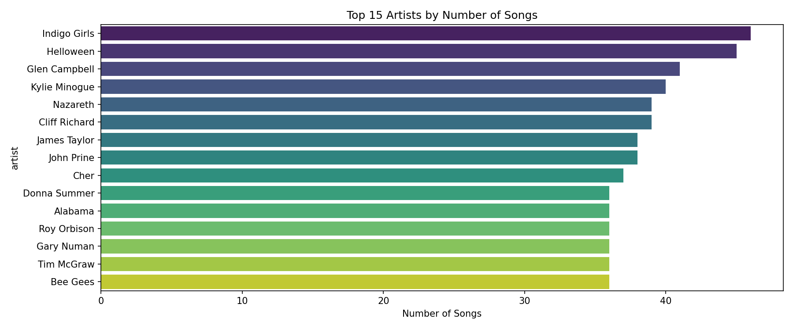

# 🎵 Music Recommendation System

A content-based music recommendation system that suggests similar songs based on **lyrics analysis** using **TF-IDF** and **Cosine Similarity**. Built with Python and deployed as an interactive **Streamlit** web application.

---

## 📌 Project Overview

| | |
|---|---|
| **Algorithm** | Content-Based Filtering |
| **Text Vectorization** | TF-IDF (Top 5000 features) |
| **Similarity Metric** | Cosine Similarity |
| **Dataset** | [Spotify Million Song Dataset – Kaggle](https://www.kaggle.com/datasets/notshrirang/spotify-million-song-dataset) |
| **Deployment** | Streamlit Web App |
| **Language** | Python 3 |

---

## 📂 Project Structure

```
Music-Recommendation-System/
│
├── System_Recommendation.py   # EDA + Preprocessing + Model Training
├── app.py                     # Streamlit Web Application
├── top_artists.png            # EDA visualization
├── requirements.txt           # Required Python packages
├── .gitignore                 # Git ignore rules
└── README.md                  # Project documentation
```

---

## 📊 Dataset

The dataset contains **57,000+ songs** from Spotify with the following features:

| Feature | Description |
|---|---|
| `artist` | Artist name |
| `song` | Song title |
| `link` | Spotify link |
| `text` | Full song lyrics |

> ⚠️ Due to memory constraints, the model is trained on a **random sample of 10,000 songs**.

---

## ⚙️ Text Preprocessing Pipeline

Each song's lyrics go through a full NLP preprocessing pipeline:

| Step | Description |
|---|---|
| **1. Lowercasing** | Convert all text to lowercase |
| **2. Remove Special Characters** | Strip punctuation and numbers |
| **3. Tokenization** | Split text into individual words |
| **4. Remove Stopwords** | Remove common English stopwords (NLTK) |
| **5. Lemmatization** | Reduce words to their base form (WordNetLemmatizer) |

---

## 🤖 How It Works

```
User selects a song
        ↓
System retrieves cleaned lyrics
        ↓
TF-IDF vectorizes the lyrics
        ↓
Cosine Similarity finds the most similar songs
        ↓
Top N recommendations returned
```

---

## 🎨 Streamlit App Features

- 🔍 **Search** any song from 10,000 songs
- 🎤 **Artist info** displayed on selection
- 🎚️ **Adjustable** number of recommendations (5–20)
- 📊 **Similarity score** shown as a progress bar
- ⚡ **Fast** — on-demand similarity computation

---

## 📈 EDA Highlights



---

## 🚀 Getting Started

### 1. Clone the repository

```bash
git clone https://github.com/Abdelrahman-Eldera3/Music-Recommendation-System.git
cd Music-Recommendation-System
```

### 2. Create virtual environment

```bash
python -m venv venv
venv\Scripts\activate
```

### 3. Install dependencies

```bash
pip install -r requirements.txt
```

### 4. Download the dataset

Download from Kaggle:
👉 https://www.kaggle.com/datasets/notshrirang/spotify-million-song-dataset

Place `spotify_millsongdata.csv` in the project directory.

### 5. Train the model

```bash
python System_Recommendation.py
```

This will generate:
- `tfidf.pkl`
- `df.pkl`
- `indices.pkl`

### 6. Run the app

```bash
streamlit run app.py
```

---

## 📦 Requirements

```
streamlit
pandas
numpy
scikit-learn
nltk
matplotlib
seaborn
```

---

## 🙋 Author

**Abdelrahman Eldera**
- GitHub: [@Abdelrahman-Eldera3](https://github.com/Abdelrahman-Eldera3)
- LinkedIn: [Abdelrahman Eldera](https://linkedin.com/in/your-linkedin)

---

## 📄 License

This project is open source and available under the [MIT License](LICENSE).
